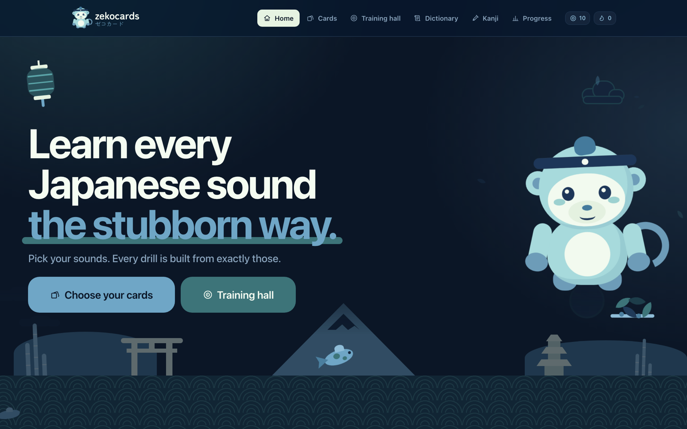
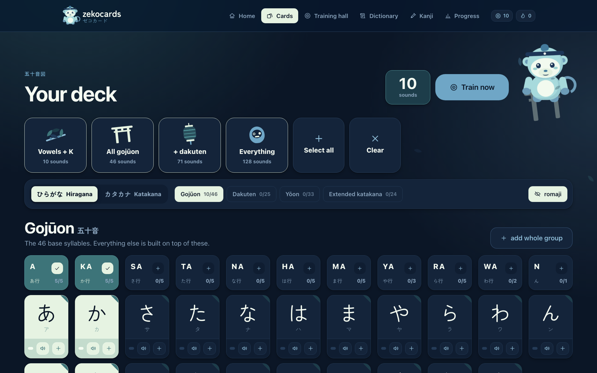
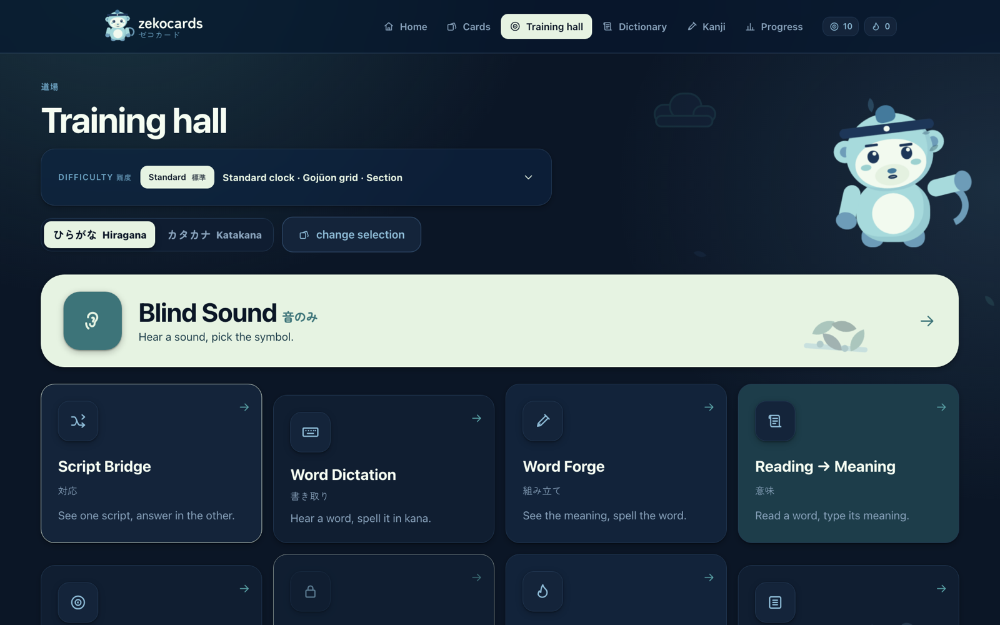
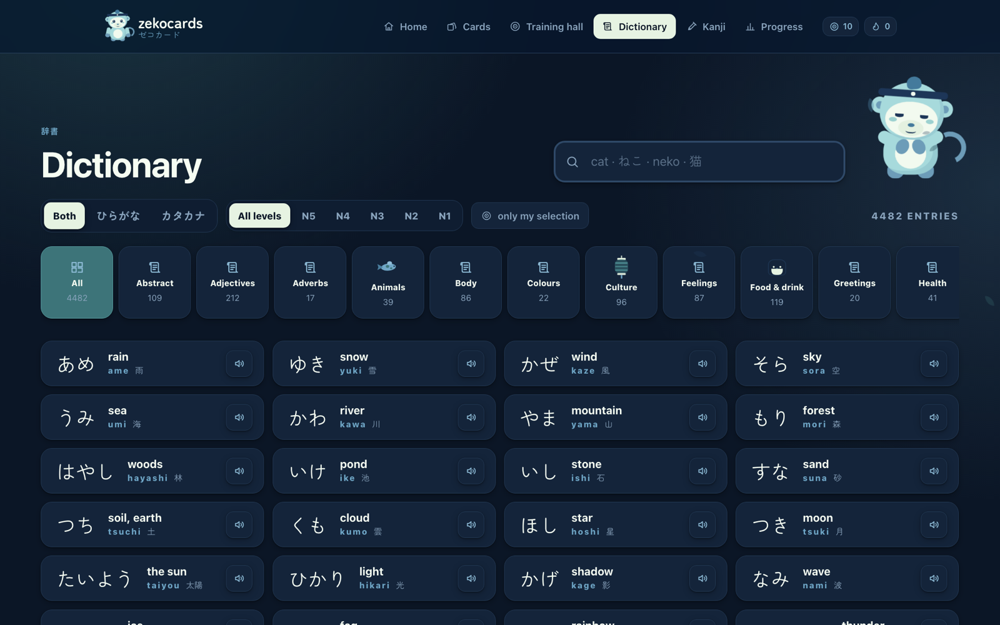
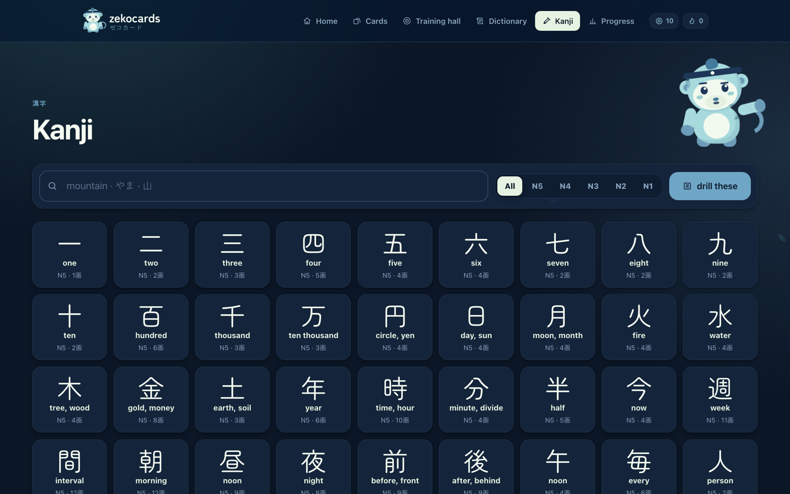

<div align="center">

# zekocards · ゼコカード

**Learn hiragana, katakana and kanji the stubborn way.**
A free browser card game built on one rule: every drill is made from exactly the sounds you picked.

[](https://zekocards.vercel.app)
[](LICENSE)
[](https://svelte.dev)
[](https://svelte.dev/docs/kit)
[](#privacy)



</div>

## What it is

Zekocards is a study tool with the manners of a quiet stationery shop. It does not gamify you into a streak; it makes you produce the right answer again and again until you can.

- **You choose your sounds.** Pick the kana columns you want to study on the *Cards* page. That selection is the single source of truth: every drill, dictionary result and example word is rebuilt from it, and nothing outside it is ever shown.
- **No multiple choice.** Answers are typed, or picked from a full section of the script, so you cannot win by elimination.
- **A miss costs a repetition, not a life.** A wrong answer never advances the question; you have to produce the correct symbol.
- **No romaji as an answer.** Typing "ka" is not reading Japanese, so romaji appears only as reference text.
- **Your own anchors.** Write a note on any card and the app quizzes you on your own words.

## Screenshots

| Choose your cards | Training hall |
|---|---|
|  |  |
| **Dictionary** | **Kanji** |
|  |  |

## Features

- **128 sounds**: gojuon, dakuten, yoon and extended katakana, each with pronunciation audio.
- **4,482 words** with readings, meanings and tags, filterable by JLPT level (N5 to N1) and by topic.
- **1,016 kanji** with meanings, on and kun readings, stroke counts and example words.
- **Nine drills** in the Training hall:

  | Drill | What you do |
  |---|---|
  | Blind Sound | Hear a sound, pick the symbol |
  | Script Bridge | See one script, answer in the other |
  | Word Dictation | Hear a word, spell it in kana |
  | Word Forge | See the meaning, spell the word |
  | Reading → Meaning | Read a word, type its meaning |
  | Look-alikes | Tell look-alike symbols apart |
  | Anchor Recall | Read your own note, find the symbol |
  | Sixty Seconds | Audio in, symbol out, one minute |
  | Kanji Grind | Kanji meanings and readings |

- **Three difficulty dials**: the clock, the order of the answer pad and how many script groups it covers. The pad is always a complete section of the script and never shrinks to your selection.
- **Progress** with a day streak, all stored in your browser.

## Privacy

Everything you do is stored in your own browser (`localStorage`, namespace `zekocards:v1:`). There is no account, no server, no analytics and no third-party script. Fonts are bundled with the app instead of being loaded from a CDN.

## Getting started

You need Node.js 18 or newer.

```bash
git clone https://github.com/davidfuentes024/zekocards.git
cd zekocards
npm install
npm run dev        # http://localhost:5173
```

| Command | What it does |
|---|---|
| `npm run dev` | Start the development server |
| `npm run build` | Build the static site into `build/` |
| `npm run preview` | Serve the production build locally |
| `npm run audio:verify` | Check the audio clips against the vocabulary |

The build is fully static (`@sveltejs/adapter-static`, with a `200.html` SPA fallback), so it can be hosted anywhere.

### Regenerating the audio

The rendered audio is committed in `static/audio/`, so you do not need to do anything to run the app. If you change the vocabulary and want new clips, `npm run audio` renders them with Azure AI Speech and packs them into audio sprites. It needs your own `AZURE_SPEECH_KEY` and `AZURE_SPEECH_REGION`, and it keeps a local cache so unchanged clips are not requested again. See [`AUDIO.md`](AUDIO.md) for the design.

## How it is built

| | |
|---|---|
| Framework | SvelteKit 2 and Svelte 5 (runes) |
| Output | Static site via `@sveltejs/adapter-static` |
| State | Svelte stores mirrored into `localStorage` |
| Audio | Pre-rendered neural TTS clips packed into WebM sprites, played through the Web Audio API |
| Fonts | Zen Maru Gothic and Zen Kaku Gothic New, bundled with Fontsource |
| Runtime dependencies | Only the two font packages |

```
src/
  lib/
    data/        kana, dictionary and kanji tables, plus the drill roster
    stores/      selection, difficulty, progress, settings (persisted)
    games/       one component per drill
    components/  cards, keypad, modal, the Zeko mascot, and more
    utils/       audio playback, answer matching, drill engine
    styles/      design tokens, base styles, components, animations
  routes/        home, cards, practice, dictionary, kanji, progress
scripts/audio/   render, verify and pack the audio sprites
static/audio/    the packed sprites and their manifest
```

[`PROJECT.md`](PROJECT.md) is the architecture map: the core constraint, the directory map, the data row formats and what must not be touched.

## Design

Zekocards has a written identity: a palette, two fonts, one icon family, a mascot (Zeko), no emoji, no generic gradients and a game-piece button language. It is documented in [`IDENTITY.md`](IDENTITY.md) and treated as fixed.

## Contributing

Issues and pull requests are welcome. Before you change anything, read [`IDENTITY.md`](IDENTITY.md) and [`PROJECT.md`](PROJECT.md): a few rules are deliberate, such as the selection-as-filter rule, the no-multiple-choice rule, the `zekocards:v1:` storage namespace (changing it erases every learner's progress) and the ban on accounts, telemetry and third-party scripts.

Safe places to extend: more words in `src/lib/data/dictionary.js` and more kanji in `src/lib/data/kanji.js`, using the same row format.

## Data and audio

The vocabulary and kanji tables are plain text rows in `src/lib/data/`. The pronunciation clips were rendered with Azure AI Speech (voice `ja-JP-NanamiNeural`). The MIT license covers the source code; if you redistribute the word lists or the audio on their own, check the terms that apply to you.

## License

[MIT](LICENSE) © 2026 David Fuentes
